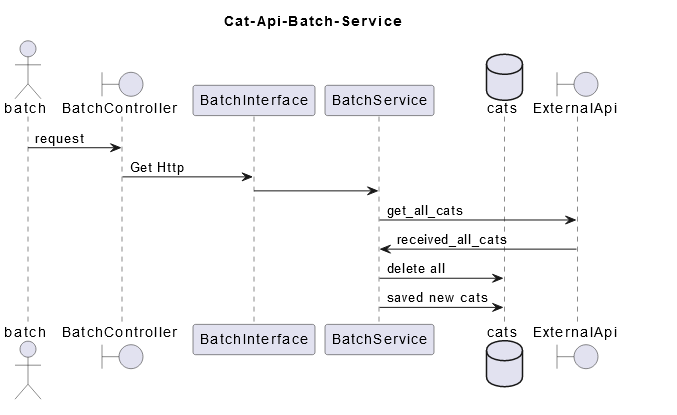
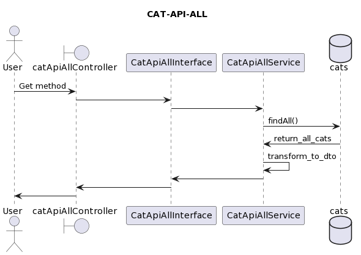
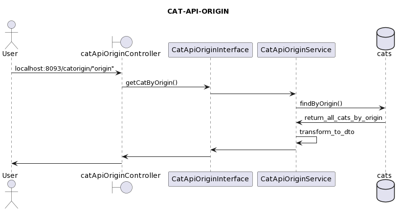
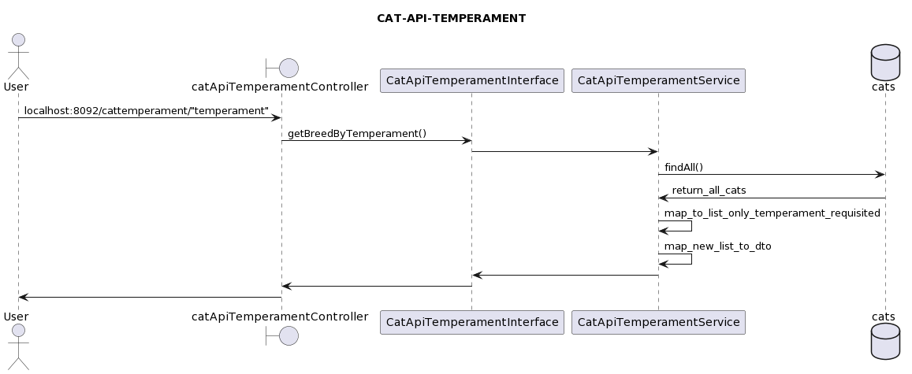
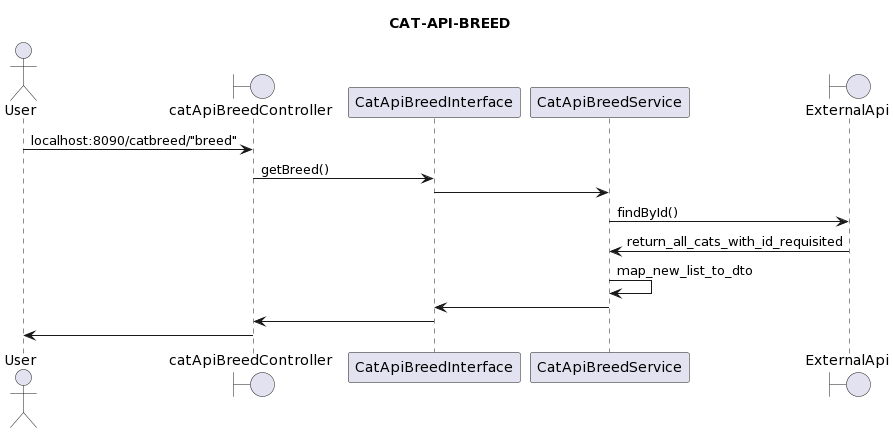

## API - CATS
the APIs aim to consume the cat api and make the appropriate treatments and filters.

Techniques used such as object orientation, micro services, clean code.

## TECHNOLOGIES
Project created with:
* Java 17
* SpringBoot
* Architecture micro-services and modules
* JUnit test
* Docker
* Slf4j - Splunk
* MySql

## CAT-API-BATCH

## CAT-API-ALL

## CAT-API-ORIGIN

## CAT-API-TEMPERAMENT

## CAT-API-BREED
